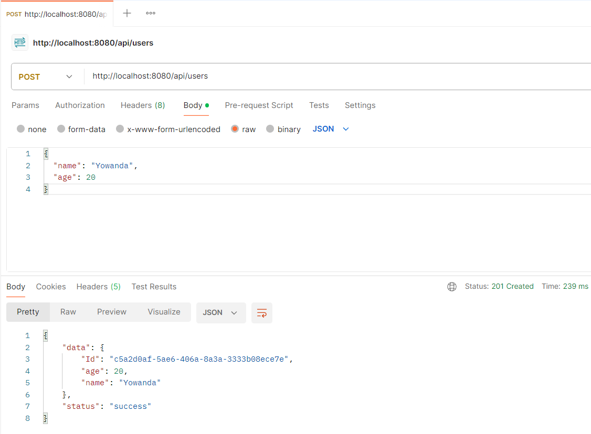
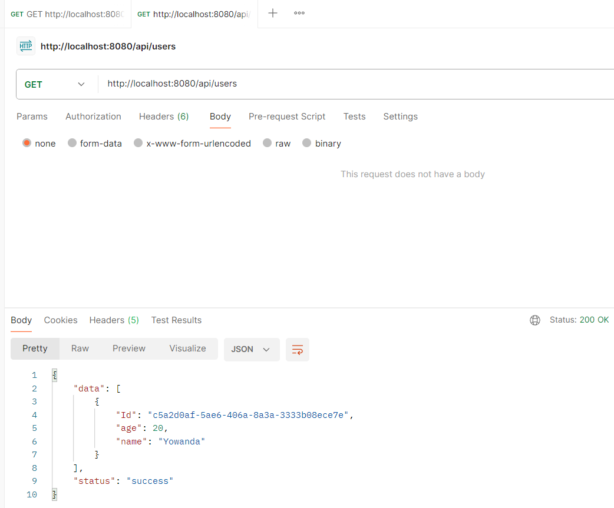
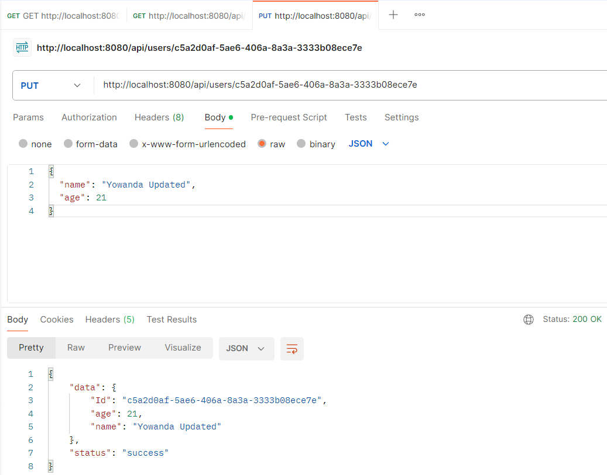
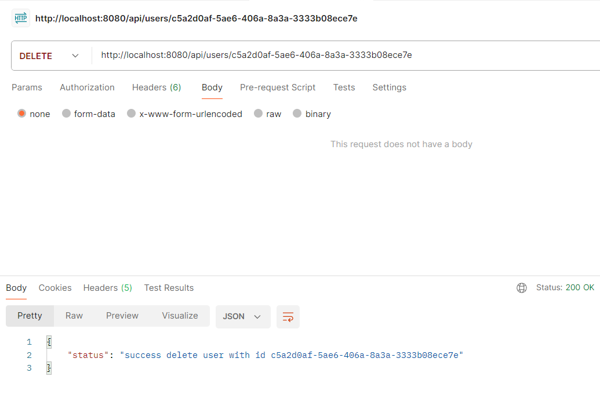
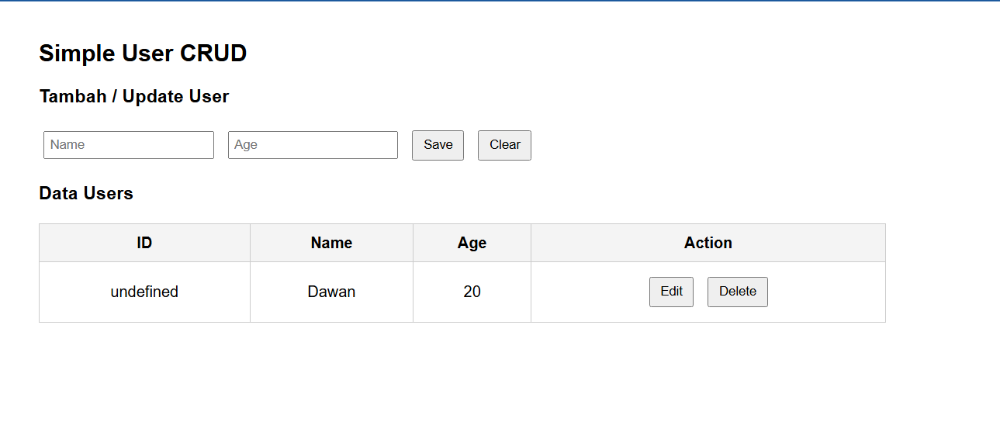
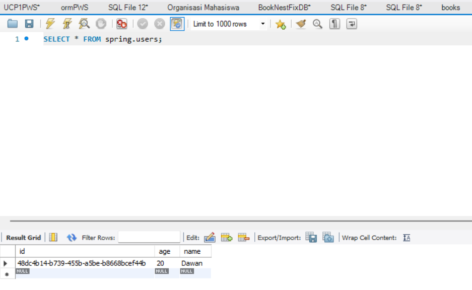

# User API Specification

## 1. Create User

Endpoint:
POST /api/users

Request Body:
```json
{
  "name": "Yowanda",
  "age": 20
}
```

Response Success (200):
```json
{
  "id": "random string",
  "name": "Yowanda",
  "age": 20
}
```



---

## 2. Get All Users

Endpoint:
GET /api/users

Response Success (200):
```json
[
  {
    "id": "uuid-1",
    "name": "Yowanda",
    "age": 20
  },
  {
    "id": "uuid-2",
    "name": "Radilla",
    "age": 22
  }
]
```


---

---

## 3. Update User

Endpoint:
PUT /api/users/{id}

Request Body:
```json
{
  "name": "Yowanda Updated",
  "age": 21
}
```

Response Success (200):
```json
{
  "id": "uuid-1",
  "name": "Yowanda Updated",
  "age": 21
}
```


---

## 5. Delete User

Endpoint:
DELETE /api/users/{id}

Example:
DELETE /api/users/uuid-1

Response Success (200):
```json
{
  "message": "user deleted successfully"
}
```


##Web Simple


##Database
